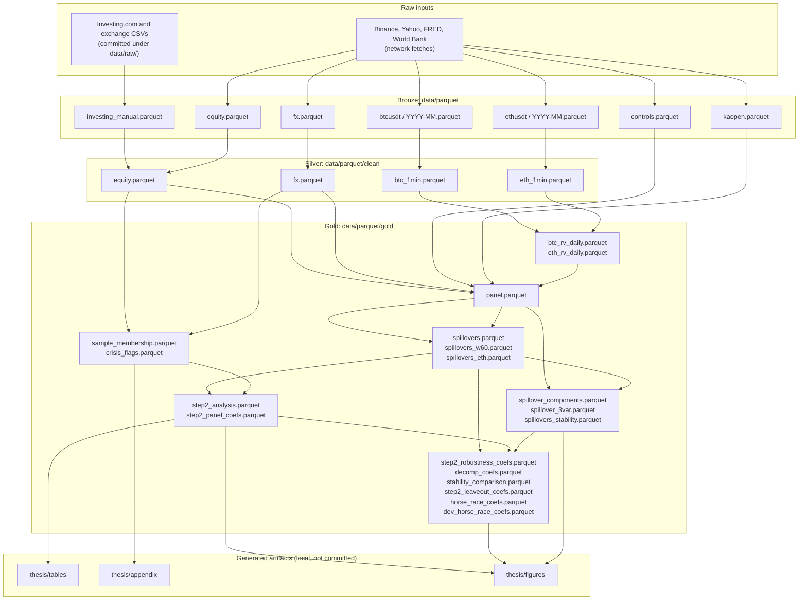

# Pipeline reference

The build is a make dependency graph over parquet layers. External fetches are manual targets that never run as a side effect of a local build; every stage that can be computed from files already on disk is wired into the graph and rebuilds when its inputs change.

## Data flow

The generated tables, appendices, and figures land in a local `thesis/` folder that stays out of version control. The scripts that write them are committed (`scripts/make_tables.py`, `scripts/make_appendix_*.py`, `scripts/make_figures.py`), so every reported number remains reproducible from the gold parquets.

## Targets

| Target | What it does | Network |
|---|---|---|
| `fetch-crypto` | Binance 1-minute BTCUSDT and ETHUSDT klines, one file per month, skips months already on disk | yes |
| `fetch-markets` | Yahoo equity indices, FX rates, VIX, S&P 500, Brent; FRED DTWEXBGS | yes |
| `fetch-investing` | Parses the committed Investing.com and exchange CSVs into `investing_manual.parquet` | no |
| `bronze` | All three bronze stages above | yes |
| `clean` | Silver layer: deduplicates, sorts, applies the glitch rule, validates schemas | no |
| `err_float.csv` rule | Regenerates the regime table from `config/countries.yaml`; uncurated countries get a -1 sentinel and fail loudly downstream | no |
| `kaopen` rule | Parses the committed Chinn-Ito workbook into `kaopen.parquet` | no |
| `features` | Realized variance for BTC and ETH, daily returns, and the country-day panel | no |
| `sample` | Applies the frozen data-quality rule in `config/sample_rule.yaml`; writes `sample_membership.parquet` | no |
| `crisis` | Flags country-years with CPI inflation of at least 25% or depreciation of at least 30% (World Bank CPI) | yes |
| `spillovers` | Rolling bivariate VAR(1) plus generalized FEVD for every country and channel, 200-day window | no |
| `panel` | Panel preparation and the Step 2 regressions (pooled OLS with Driscoll-Kraay standard errors, two-way fixed effects, H2 and H3 specifications) | no |
| `robustness` | Winsorized log-odds outcome and the 60-day window variant | no |
| `decomposition` | Variance-component diagnostics and the trivariate system with the broad dollar index | no |
| `stability` | Records each rolling window's companion-matrix spectral radius | no |
| `stability-coefs` | Re-runs the headline results excluding non-stationary windows, next to an unfiltered baseline | no |
| `leaveouts` | Crisis-country drop, Ethereum as transmitter, and the trivariate specification | no |
| `horse-race` | Global-risk and development horse races (openness, VIX, dollar index, GDP per capita, private credit all interacted with standardized crypto stress) | no |
| `h3-extra` | Extended H3 diagnostics: the two-way fixed-effects rung and the equity placebo | no |
| `fetch-dev` | World Bank development controls (GDP per capita, private credit, 2019-2023 means) | yes |
| `tables` | Generates the regression tables into a local `thesis/tables/` | no |
| `appendix` | Generates the sample and variable appendices into a local `thesis/appendix/` | no |
| `figures` | Generates the result figures into a local `thesis/figures/` | no |
| `diagrams` | Renders the conceptual framework diagram from its Graphviz source (requires the `dot` binary) | no |
| `check` | Runs the test suite (190 tests) | no |
| `all` | Every local stage above, in dependency order | no |

## Conventions

- A target that talks to an external service is manual and marked in the table above. `make all` never hits the network.
- Every parquet write passes a Pandera schema contract before the file is accepted by the next stage.
- Missing observations stay missing at every layer. There is no forward-fill, interpolation, or imputation anywhere in the pipeline.
- All FX rates are local currency per USD, so an increase always means depreciation.
- The frozen sample binds the regressions in `panel_prep`: spillover shares for channels that failed the data-quality rule are set to NaN rather than dropped, so the regression sample is auditable.
- Tables, appendices, and figures are generated exclusively from the gold parquets and the config files. Nothing is hand-transcribed.

## Typical runtimes

| Stage | Approximate time |
|---|---|
| `fetch-crypto` | under an hour for the full 2019-2025 grid at polite request rates |
| `spillovers` | about 10 minutes per variant (baseline, 60-day, Ethereum) |
| `stability` | about 7 minutes |
| `check` | about 2 minutes |
| `all` | roughly an hour on a modern laptop |
