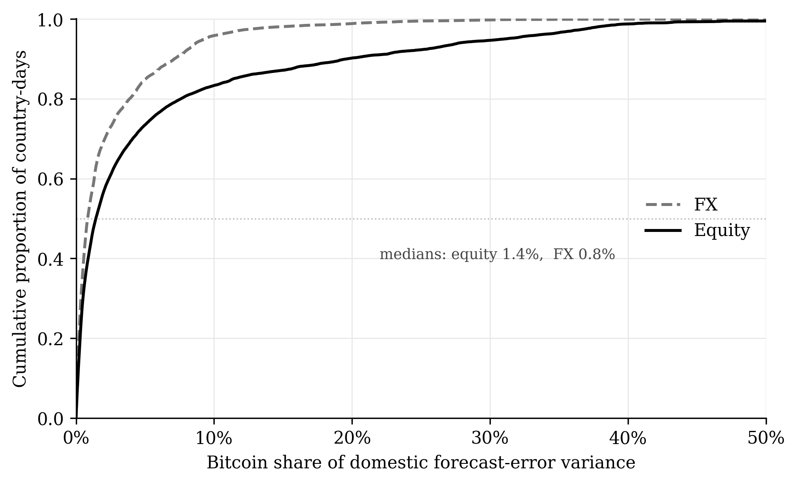
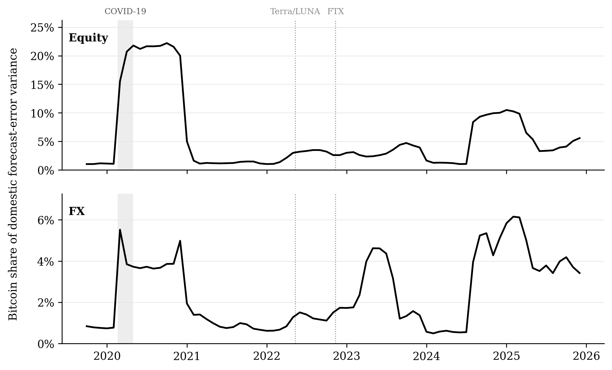
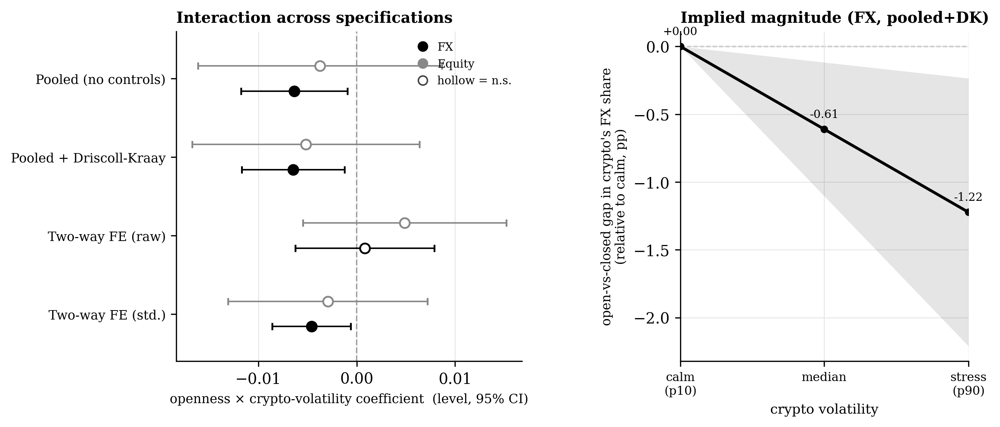
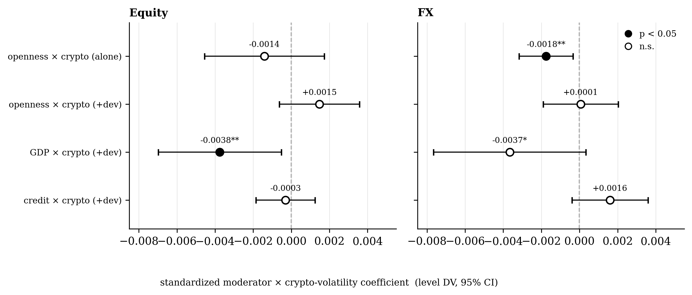
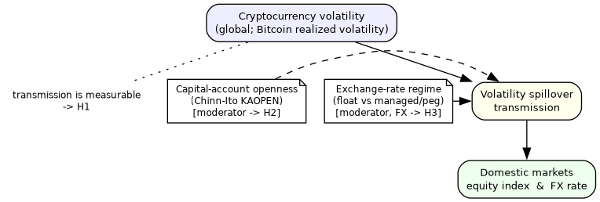
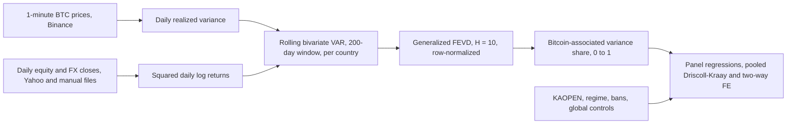
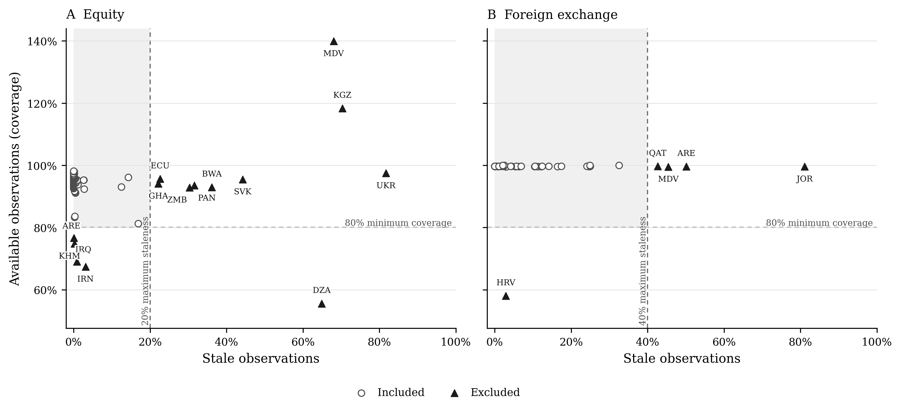
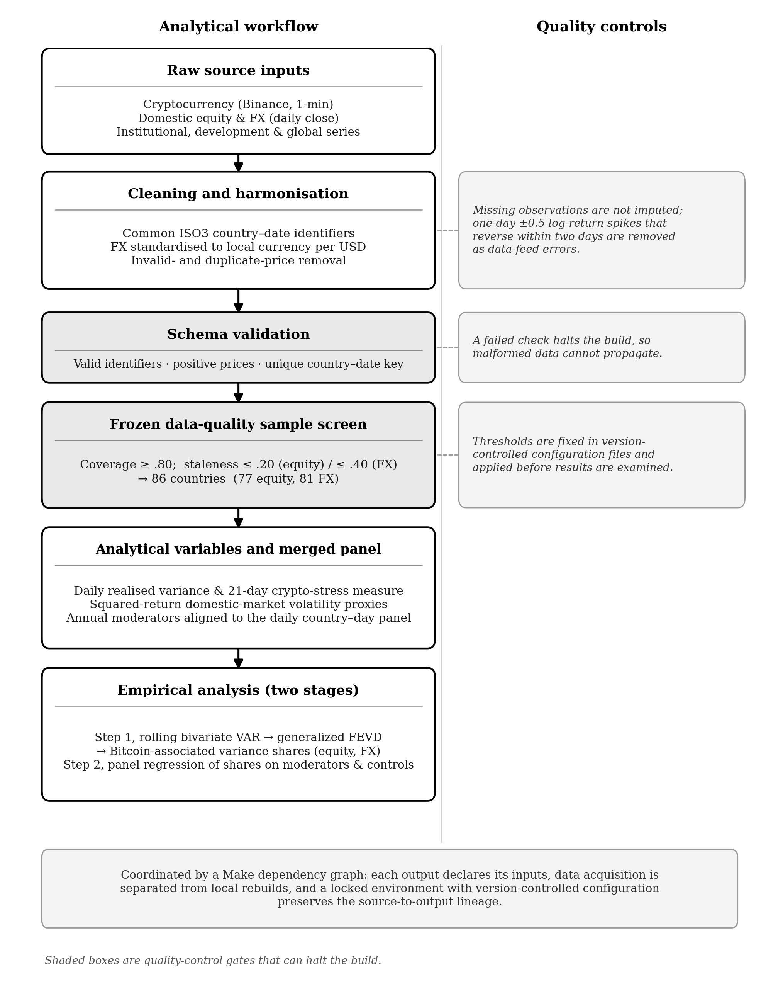

# Capital-Account Openness and Crypto Volatility Spillovers


An end-to-end quantitative research pipeline. Roughly 3.7 million one-minute Binance klines per crypto asset become daily realized variance, rolling spillover estimates for 86 countries, and a panel econometrics suite that asks whether capital-account openness shapes how Bitcoin volatility reaches domestic equity and foreign exchange markets.

## What it asks

1. Do crypto volatility spillovers reach domestic equity and FX markets at all?
2. Does the degree of capital-account openness shape how strongly they transmit?
3. Does exchange-rate flexibility change the FX channel?

## What it found

| Hypothesis | Verdict | Headline evidence |
|---|---|---|
| H1: Bitcoin-associated variance shares are measurable and time-varying | Supported descriptively | Mean share 5.79% in equity and 2.45% in FX; positive in every estimable market (77 equity, 81 FX) |
| H2: More open capital accounts show stronger spillovers | Not supported | FX openness x crypto stress is negative (beta = -0.0065, p = .015), the opposite of the prediction; it collapses to zero once development moderates (+0.0001, p = .92) |
| H3: Floating regimes show stronger FX transmission | Not supported | Float x crypto stress is negative and not robust; the only significant estimate loses significance once openness is included |

The transmission measure is a variance share, a relative quantity, and the honest conclusion follows from reading it that way. A lower share does not prove weaker absolute transmission; it can reflect a larger domestic volatility base. The study decomposes the share into its components and finds only suggestive evidence for the larger-denominator reading. Separately, capital-account openness correlates at 0.66 with log GDP per capita in this sample, so openness cannot be separated from development: the headline FX interaction survives a global-risk horse race (openness also interacted with the VIX and the broad dollar index, beta = -0.0072, p < .01) but falls by half and loses significance when the euro-area FX series are collapsed into one representative currency.

The distribution of the headline measure, by channel:



Shares are small on the typical country-day and strongly right-skewed, and the equity distribution sits to the right of FX throughout. Both channels rise during 2020 and again in 2024 and 2025, and neither responds visibly to the Terra/Luna or FTX collapses:



The H2 test in one chart: the fitted difference between a fully open and a fully closed economy widens to about -1.2 percentage points at high crypto volatility, the opposite of the hypothesized sign:



And the reason the result is not an openness result: once GDP per capita and private credit are allowed to moderate crypto stress alongside openness, the openness interaction is indistinguishable from zero. Openness and development are entangled, and the data cannot tell them apart:



## The design in one page





**Stage 1 builds the transmission measure.** For each country and channel, a rolling bivariate VAR(1) pairs Bitcoin realized variance with a local volatility proxy, the squared daily log return of the equity index or of the local-currency-per-USD exchange rate. A generalized forecast-error variance decomposition, which does not impose a variable ordering the way Cholesky does, gives the share of the local market's 10-day-ahead forecast-error variance associated with Bitcoin innovations. The window covers 200 local trading days with a minimum of 180 synchronized observations, and every estimate is dated at the end of its window. The measure is connectedness, not causation: a bivariate system cannot separate Bitcoin-specific shocks from common global shocks, so the share is read as an upper bound on strictly crypto-specific transmission.

**Stage 2 explains the share.** A country-day panel regresses the share on cryptocurrency stress (the log of the trailing 21-day mean of Bitcoin realized variance), the Chinn-Ito openness index (annual, 2023 vintage carried forward), their interaction, a time-varying crypto-restriction indicator, development controls, and daily global controls (VIX, broad dollar index, S&P 500, Brent). The primary estimator is pooled OLS with Driscoll-Kraay standard errors (Bartlett kernel, bandwidth 200, matched to the rolling window), with two-way fixed effects as a sensitivity check and a winsorized log-odds transformation as a distributional check.

**The robustness battery.** 60-day windows alongside the 200-day baseline; crisis-country leave-out (11 countries flagged by CPI inflation of at least 25% or annual depreciation of at least 30%); Ethereum replacing Bitcoin as the transmitter; a global-risk horse race and a development horse race that let rival moderators interact with crypto stress; a trivariate system that adds the broad dollar index to the first stage; variance-component diagnostics that separate the share into numerator and denominator parts; a spectral-radius screen that drops non-stationary rolling windows; and a euro-area redundancy check. Every one of these is a make target in this repository.

## Data and sample

| Data | Source | Frequency | Role |
|---|---|---|---|
| BTC and ETH prices | Binance REST API, 1-minute klines | 1 minute | Transmitting assets; ETH is robustness only |
| Equity indices | Yahoo Finance, plus manually imported Investing.com and official-exchange files | Daily | Receiving market |
| FX rates | Yahoo Finance, plus Investing.com files and one peg-derived series | Daily | Receiving market, local currency per USD |
| Capital-account openness | Chinn-Ito KAOPEN index | Annual | Primary moderator |
| Exchange-rate regime | IMF AREAER, de facto classification | Country-year | FX-channel moderator (float vs managed or peg) |
| Crypto restrictions | Curated episode file from regulator documents | Country-day | Control |
| GDP per capita, private credit | World Bank | Annual | Development controls (2019-2023 means) |
| VIX, S&P 500, Brent | Yahoo Finance | Daily | Global controls |
| Broad dollar index | FRED DTWEXBGS | Daily | Global control (the broad trade-weighted index, not the ICE DXY) |

The configured universe has 89 countries. A frozen, configuration-based, data-quality-only inclusion rule retains 86: a country-channel qualifies when coverage reaches 80% of expected business days and staleness stays below 20% for equity and 40% for FX. The rule is stored in `config/sample_rule.yaml` and applied mechanically by the engine in `src/sample/`, so the sample cannot be accused of cherry-picking:



78 equity series pass the screen (77 estimable after one technical exclusion) and 81 FX series are estimable.

## How it works



The pipeline separates raw sources, validated cleaning, the frozen sample screen, analytical variables, and the two estimation stages, and rebuilds downstream artifacts from their declared inputs through a make dependency graph. Data acquisition is never mixed into analytical rebuilds: anything that talks to the network is a manual target, and `make all` never touches it.

Three rules govern the data work. Missing observations stay missing: nothing is forward-filled, interpolated, or imputed, because a synthetic price creates an artificial zero return that mechanically lowers measured volatility. All FX rates follow one convention, local currency per USD, so an increase always means depreciation. One conservative glitch rule removes a one-day log return beyond plus or minus 0.5 only when it fully reverses within two trading days.

Every parquet write passes a Pandera schema contract before the next stage accepts it, and every reported number is generated by scripts from the gold parquets, never transcribed by hand.

## Running it

Prerequisites: Python 3.11 or newer, [uv](https://docs.astral.sh/uv/), and a free FRED API key if you want to refresh the broad dollar index series.

```bash
uv sync            # installs the locked environment
make check         # runs the test suite
```

```bash
# Fetch raw inputs (network)
make bronze        # Binance 1-minute BTC/ETH, Yahoo equity/FX/controls, FRED dollar index
make fetch-dev     # World Bank development controls
make crisis        # World Bank CPI for the crisis flags

# Rebuild every analytical stage and the generated tables and figures
make all
```

On a machine that already has the parquet data under `data/parquet/`, `make all` alone reproduces the whole analysis without touching the network. The longest stages are the spillover estimates (about 10 minutes per variant) and the stability diagnostics (about 7 minutes); a full `make all` takes roughly an hour. The manual raw inputs that cannot be re-downloaded (the Investing.com files and the AREAER classification sources) are committed under `data/raw/`, so the pipeline is fully reproducible given the network fetches.

Individual stages: `make sample`, `make spillovers`, `make panel`, `make robustness`, `make decomposition`, `make stability`, `make leaveouts`, `make horse-race`, `make h3-extra`, `make tables`, `make appendix`, `make figures`. A complete target reference with network flags and the data-flow diagram is in [PIPELINE.md](PIPELINE.md).

## Reproducibility

Committed inputs: code, configuration (country universe, sample rule, regime assignments, ban episodes, ingestion settings), the manual raw files under `data/raw/`, and the locked environment (`uv.lock`). Derived parquet layers under `data/parquet/` are gitignored and rebuilt by the targets above. The regression tables and figures shown in this README are generated from the gold outputs by `scripts/make_tables.py` and `scripts/make_figures.py`.

## Repository layout

```
config/        Country universe, sample rule, regime table, ban episodes, ingestion settings
src/           Python package: fetchers, cleaning, features, sample engine, spillovers, models, schemas
scripts/       Fetch scripts and the table, appendix, and figure generators
tests/         Unit tests on fixtures, plus guarded integration tests against the real parquet layers
notebooks/     Four walkthroughs with rendered charts
assets/        Figures used in this README
data/raw/      Committed manual inputs: Investing.com files, AREAER sources, Chinn-Ito workbook
data/parquet/  Derived bronze, silver, and gold layers (gitignored, rebuilt by make)
```

## Notebooks

- [01_data_coverage.ipynb](notebooks/01_data_coverage.ipynb): coverage audit of every series and the source choices it forced
- [08_understanding.ipynb](notebooks/08_understanding.ipynb): an end-to-end tour of the pipeline, run after `make panel`
- [09_spectral_radius_robustness.ipynb](notebooks/09_spectral_radius_robustness.ipynb): the VAR-stability screen behind `make stability`
- [10_euro_fx_duplication.ipynb](notebooks/10_euro_fx_duplication.ipynb): the euro-area redundancy check for the FX panel

## Testing and CI

`make check` runs 190 tests. Unit tests exercise every pipeline module against synthetic fixtures, and integration tests validate the real parquet layers against known invariants (panel shape, distributional properties, known event dates). The integration tests skip automatically when the data has not been built, so a GitHub Actions workflow installs the locked environment and runs the full suite on every push to a fresh runner.

## What I would do next

Engineering:

- Data versioning with DVC so every derived layer carries a content hash, not just a timestamp
- A devcontainer or Docker image so the environment is one command, not a uv install
- ruff, mypy, and pre-commit hooks to make style and typing checks part of the build
- Parallelize the spillover estimation across country-channel pairs, the cleanest large speedup left
- Incremental ingestion that appends new Binance months without re-reading the full history

Research:

- More granular capital-control measures (the Fernández et al. asset-class breakdowns) to replace the aggregate Chinn-Ito index
- Policy-reform event studies that use within-country changes in openness instead of the mostly cross-sectional comparison
- A finer exchange-rate classification than the binary float/managed split, since intervention intensity varies a lot inside each group
- Local crypto prices, stablecoin flows, and on-chain activity to trace the actual transmission channels
- Multivariate connectedness systems that carry global factors in the first stage rather than in the panel controls
